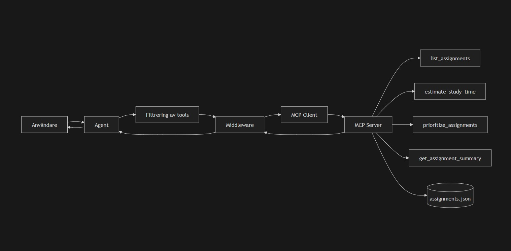

# 3agents-langchain-demo
[School assigment] Creating three agents for different purposes and with different functionality.

# Köra agenterna

Alla agenter körs från terminalen:

# 1. Kanjiassistent

```bash
py -m examples.agent-lecture.kanji_agent
```

Vad den gör
- Förklarar kanji och japanska ord
- Ger läsningar (kun/on)
- Ger exempelord med japanska tecken
- Anpassar nivå (t.ex. nybörjare)

Exempel på frågor
- Förklara kanji 水
- Vad betyder 食べる?
- Vad är skillnaden mellan は och が?

# 2. Rese-/researchagent

```bash
py -m examples.agent-lecture.travel_research_agent
```

Vad den gör
- Läser webbsidor och sammanfattar innehåll
- Analyserar och jämför resmål
- Kan använda lokala reseanteckningar
- Kan göra enkla budgetberäkningar

Exempel på frågor
- Läs filen data/travel_notes.txt och föreslå vilket resmål som passar bäst för kultur
- Läs den här sidan och sammanfatta den:
https://en.wikipedia.org/wiki/Kyoto

# 3. Beräkningsassistent

```bash
py -m examples.agent-lecture.calculation_agent
```

Vad den gör
- Utför matematiska beräkningar
- Räknar procent, budget och vardagsekonomi
- Kan läsa filer med siffror och analysera dem

Exempel på frågor
- Vad är 15 procent av 2490?
- Räkna ut (3500 + 2200) / 2
- Läs filen data/budget.txt och räkna ut hur mycket pengar som är kvar efter utgifter

---
Exempelfiler
Projektet innehåller exempeldata i data/:
- japanese_notes.txt – japanska begrepp
- travel_notes.txt – reseidéer och budget
- budget.txt – enkel ekonomi

Alla agenter:
- använder samma grundstruktur
- har egen systemprompt
---
# MCP Study Agent

Detta projekt innehåller en agent som använder en extern MCP-server för att hjälpa användaren planera och analysera skoluppgifter.

# Funktionalitet

Agenten kan:

Lista uppgifter
Prioritera vad som ska göras först
Uppskatta hur lång tid en uppgift tar
Ge en sammanfattning av uppgifter

Agenten använder verktyg från en extern MCP-server.

# Viktiga krav (uppfyllda)

1. Koppling till MCP-server

Agenten ansluter via HTTP:

"url": "http://127.0.0.1:8000/mcp"

2. Filtrering av verktyg

Agenten får endast tillgång till ett urval av verktyg:

ALLOWED_TOOL_NAMES = {
    "list_assignments",
    "estimate_study_time",
    "prioritize_assignments",
    "get_assignment_summary",
}

Filtreringen sker i agentkoden, inte i MCP-servern.

3. Middleware

Agenten använder middleware med @wrap_tool_call för att bearbeta output från MCP-servern innan den används.

# Starta agenten

Aktivera virtual environment:

source .venv/Scripts/activate

Installera dependencies:

pip install -r requirements.txt

Starta agenten:

python -m examples.agents.mcp_assignment_agent
Körordning
Starta MCP-servern (i separat terminal)
Starta agenten

---
Exempel på frågor
Vilka uppgifter har jag?
Vilken uppgift borde jag börja med först?
Hur lång tid tar en uppgift med 20 sidor, 5 övningar och svårighetsgrad 4?
Ge mig en sammanfattning av mina uppgifter.
Lägg till en ny uppgift

(Sista frågan visar att agenten inte har tillgång till alla verktyg.)
---
# Arkitektur


# Syfte

Projektet demonstrerar hur en agent kan använda externa verktyg via MCP, samt hur verktyg kan filtreras och resultat bearbetas innan de används.